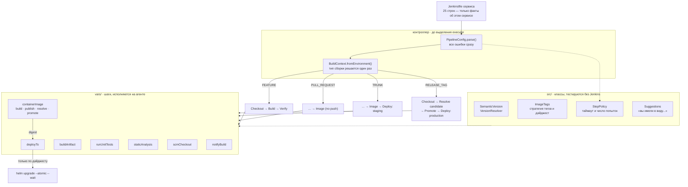

# jenkins-shared-library

Jenkins shared library, которая превращает скопированный из соседнего репозитория
Jenkinsfile на 124 строки в 25 строк конфигурации — и, в отличие от почти всех
shared library в природе, **покрыта тестами**, исполняющими сам пайплайн.

```
./gradlew check     # 122 теста + CodeNarc, полминуты-минута
```

---

## Задача

Shared library пишут, когда одинаковый Jenkinsfile расползся по двадцати репозиториям.
Вынести общее в библиотеку — половина задачи и не самая интересная. Интересная в том, что
после выноса этот код становится невидимым: он больше не лежит в репозитории сервиса, его
больше не читают на ревью пул-реквеста, и он одновременно управляет доставкой всех двадцати
сервисов.

Дальше происходит предсказуемое. В `examples/Jenkinsfile.before` лежит настоящий
Jenkinsfile — не соломенное чучело, каждая ошибка в нём когда-то была кратчайшим способом
завести сборку:

**Пароль подставлен в строку.** `sh "docker login -u ${REG_USER} -p ${REG_PASS} ..."` —
GString раскрывается в Groovy, значит команда с паролем уходит в консольный лог, в файл
сборки на диске и в то, что эти логи куда-нибудь пересылает. Jenkins маскирует ровно ту
строку, которую выдал как credential; ничего похожего — base64, URL с токеном, значение,
разорванное переносом — он не маскирует.

**`junit` стоит после `sh`.** Упавший `mvn test` бросает исключение, публикация отчёта не
выполняется, и единственная сборка, отчёт которой кому-то нужен, — единственная сборка без
отчёта.

**Ни у одного шага нет таймаута.** `docker push` в реестр, который принял соединение и
замолчал, держит executor до утра.

**`latest` двигается на каждой сборке ветки**, включая release candidate.

**Деплой ссылается на тег.** Между «человек нажал Deploy» и «кластер сделал pull» тег можно
перевести на другой образ, и апрув всё равно будет выглядеть выданным.

**Тег релиза пересобирается из исходников.** Значит в прод едет не тот образ, который
тестировали на trunk: базовые образы и индексы пакетов двигаются под неизменившимся
Dockerfile.

**`when` дублирует условие ветки в пяти местах** и эти пять мест расходятся. В файле выше
`stage('Test')` содержит `not { branch 'main' }` — кто-то отключил тесты на main в пятницу.
Это не выдумка ради примера; это то, что находится в реальных Jenkinsfile, потому что
условие ветки написано пять раз и каждое правится отдельно.

Библиотека нужна не чтобы этих строк стало меньше. Она нужна, чтобы решения такого рода
принимались один раз, лежали в одном месте и **проверялись тестом**, а не хранились в
голове человека, который их когда-то написал.

---

## Архитектура



Разделение на `src/` и `vars/` — не формальность разметки Jenkins. Всё, что можно решить без
Jenkins, решается в `src/`: там нет ни одного вызова шага, классы помечены `@CompileStatic`
и тестируются обычным JUnit за миллисекунды. В `vars/` остаётся только то, что действительно
разговаривает с Jenkins. Граница проведена так, чтобы вся содержательная логика — какая
версия, какие теги, что валидно, что можно повторять — оказалась по первую сторону.

### Что происходит на каждом типе сборки

| Тип сборки | Стадии | Что уезжает |
|---|---|---|
| топик-ветка | `Checkout → Build → Verify` | ничего |
| pull request | `… → Image (no push)` | ничего, но Dockerfile проверен |
| trunk (`main`) | `… → Image → Deploy: staging` | `<version>`, `sha-<7>`, `main`; деплой по дайджесту |
| тег `v1.5.0` | `Checkout → Resolve release candidate → Promote image → Deploy: production` | `1.5.0`, `1.5`, `1`, `latest` на **уже существующий** дайджест |
| тег `v2.0.0-rc.1` | то же | только `2.0.0-rc.1` |

Последовательность стадий зафиксирована тестами по одному тесту на тип сборки плюс
записанные callstack-и целиком. Это и есть контракт библиотеки: именно эти строки исчезли
из Jenkinsfile сервиса и, значит, именно их больше никто не читает на ревью.

---

## Решения и компромиссы

### Shared library, а не движок шаблонов и не «просто Jenkinsfile»

Вариантов три, и у каждого своя цена.

**Оставить обычные Jenkinsfile.** Честный вариант для трёх репозиториев. На двадцати он
означает, что «добавить проверку подписи образа» — это двадцать пул-реквестов, из которых
восемнадцать сольются, один зависнет, а один сервис останется без проверки навсегда, и
никто не заметит, потому что никто не сравнивает двадцать файлов между собой.

**Jenkins Templating Engine** (или Pipeline Template Catalog) — вариант, который решает
ровно ту жалобу, что у shared library нет способа запретить сервису делать по-своему. JTE
даёт иерархию конфигураций и подстановку «библиотек шагов» в шаблон. Отказался по двум
причинам. Первая: это отдельный плагин с собственным DSL и собственной моделью
наследования, и знание про него не переносится никуда — оно живёт внутри одного плагина
одного CI. Вторая, важнее: JTE-конфигурация проверяется тем, что её запускают. Юнит-тест
для неё написать значительно труднее, чем для Groovy-класса, а вся ставка этого репозитория
именно на тесты.

**Shared library** — то, что здесь. Обычный Groovy, обычный Gradle, обычный JUnit; ничего
специфичного для Jenkins в `src/`. Компромисс, который при этом принимается сознательно:
библиотека **не может** запретить сервису написать свой Jenkinsfile мимо неё. Запрет — это
вопрос ревью и настроек контроллера, а не библиотеки. Всё, что можно сделать со стороны
кода, — сделать правильный путь заметно короче неправильного: 25 строк против 124.

### Declarative снаружи, scripted внутри

Jenkinsfile сервиса выглядит декларативно — это буквально одна структура данных. Внутри
`standardPipeline` — scripted pipeline: `node { stage { ... } }`.

Причина не в моде на scripted. Declarative `pipeline { }` внутри `vars/` формально возможен,
но у него нет способа собрать список стадий во время исполнения: `when` умеет включать и
выключать заранее написанную стадию, а не порождать её. Пайплайн, где на теге вообще нет
стадии `Build`, а на trunk есть `Deploy: staging`, которой нет на pull request, в
declarative выражается только через полное дублирование с пятью `when` — то есть ровно
через то, от чего мы уходим. Плюс параллельный веер с `failFast` в declarative задаётся
статически.

Цена честная: внутри библиотеки нет `post`-секции, нет `options { timeout() }` даром и нет
визуального редактора этапов. `post` заменён `try/finally` в `standardPipeline` (и это
оказалось скорее плюсом — см. ниже про `currentBuild.result`), таймауты заданы явно
`StepPolicy`, а визуальный редактор Blue Ocean всё равно давно не сопровождается.

Обратное направление тоже стоит назвать: библиотека **не** годится тому, кто хочет
declarative Jenkinsfile со своими стадиями и вызовом пары шагов из библиотеки. Отдельные
шаги (`scmCheckout`, `containerImage`, `deployTo`) из declarative вызываются нормально, но
`standardPipeline` — целиком scripted и заменяет `pipeline { }`, а не дополняет его.

### Конфигурация — Map, а не closure-DSL

Соблазнительная альтернатива выглядит красивее:

```groovy
standardPipeline {
    name = 'checkout-api'
    image { registry = 'registry.example.internal' }
}
```

Отказался, и это одно из решений, о которых я жалел бы меньше всего. Closure-DSL требует
`resolveStrategy = DELEGATE_FIRST` и порождает нечитаемые ошибки: опечатка `imag { }`
превращается в `MissingMethodException` в момент исполнения, с указанием на строку внутри
библиотеки, а не в Jenkinsfile. Хуже того, свойство, которого нет в делегате, часто просто
уходит в `binding` и молча теряется.

Map — это данные. Их можно провалидировать целиком в одном месте до того, как что-либо
начало исполняться, напечатать в лог, собрать программно и сравнить с ожидаемым в тесте.
Опечатка в ключе даёт:

```
standardPipeline: 5 problems in the Jenkinsfile
  - unknown option 'buildTools'. Did you mean 'buildTool'? Allowed: agentLabel, buildTool, ...
  - 'name': 'Checkout API' is not usable as a release name. Lower case letters, digits and dashes...
  - 'buildTool': required, one of docker, gradle, maven, npm
  - environments.prod: unknown environment. Known: dev, staging, production. Did you mean 'production'?
  - 'environments' declares prod but there is no 'image' block. This pipeline deploys container
    images; without one there is nothing to roll out.
```

Проигрыш — синтаксис с запятыми и квадратными скобками вместо блоков. Это цена, которую я
готов платить каждый раз.

### Валидация до `node`, и все ошибки сразу

`PipelineConfig.parse()` вызывается на контроллере, **до** входа в `node { }`. Два свойства,
и оба намеренные.

**До выделения executor.** Опечатка в Jenkinsfile не должна стоить слота исполнителя и
сорока минут. Тест на это есть буквально такой: после падения валидации в записанном
callstack нет вызова `node`.

**Все проблемы за один проход.** Валидатор собирает список и бросает один раз. Альтернатива
— падать на первой ошибке — превращает исправление Jenkinsfile в цикл «правка → пять минут
сборки → следующая ошибка». Три-четыре круга такого цикла, и человек перестаёт пользоваться
библиотекой.

Что валидируется помимо орфографии: имя сервиса проверяется как DNS-имя (оно становится
именем Helm-релиза и именем lock-ресурса), namespace — по правилам Kubernetes, репозиторий и
хост реестра — по грамматике OCI. Все эти правила существуют не «для строгости»: каждое
описывает отказ, который иначе случился бы в конце длинной сборки, там, где сообщение об
ошибке приходит от чужого инструмента.

Отдельная категория — **конфликты**. `skipTests: true` вместе с объявленным окружением
`production` отклоняется: апрув перед деплоем не умеет поймать непротестированный код, а
выглядит так, будто умеет. `environments` без блока `image` отклоняется: разворачивать
нечего. `steps.deploy.attempts: 3` отклоняется с объяснением, почему именно этот шаг не
повторяют.

«Вы имели в виду» построено на двух правилах, потому что ошибки бывают двух форм: опечатки
близки по расстоянию Левенштейна (`buildTools` → `buildTool`), а сокращения — нет
(`prod` от `production` в шести правках) и разворачиваются по префиксу, но только если
кандидат ровно один.

### Релизный тег продвигает образ, а не пересобирает его

Самое содержательное решение в репозитории.

Обычный релизный пайплайн на теге делает `docker build` из отмеченного коммита. Коммит тот
же, Dockerfile тот же — значит образ тот же? Нет. `FROM python:3.13-slim` неделю спустя
разрешается в другой дайджест; `apt-get install` и `npm ci` тянут другие версии. В прод
уезжает образ, который никто не тестировал, с номером версии образа, который тестировали.

Поэтому на теге здесь нет ни `Build`, ни `Verify`. Есть:

1. `Resolve release candidate` — найти дайджест по тегу `sha-<короткий-коммит>`, который
   опубликовала сборка trunk этого коммита;
2. `Promote image` — `docker buildx imagetools create`, который копирует манифест и
   навешивает `1.5.0`, `1.5`, `1`, `latest` на **тот же дайджест**;
3. `Deploy: production` — деплой по `repository@sha256:...`.

Если образа нет, сборка падает с текстом, который говорит, что делать: «тег `v1.5.0`
указывает на коммит `b17a4d0`, для которого нет опубликованного образа; ставьте тег на
коммит, собранный на `main`».

Побочный выигрыш заметный: релиз занимает секунды вместо получаса, потому что ничего не
компилируется. Побочная цена тоже честная: **нельзя выпустить релиз из коммита, который не
проходил через trunk**. Это ограничение, а не баг, но оно ощущается в hotfix-сценарии — там
нужно сначала провести исправление через trunk. Альтернатива — разрешить сборку на теге —
возвращает ровно ту проблему, ради которой всё это сделано.

По той же логике деплой принимает только дайджест. `deployTo` отказывается работать с тегом
до того, как что-либо коснулось кластера:

```
deployTo(staging): refusing to deploy 'registry.example.internal/platform/checkout-api:1.4.3'.
A deploy takes a digest, not a tag. Tags are mutable, including release tags: between the
moment someone approves a rollout and the moment the cluster pulls, a tag can be made to
point somewhere else, and the approval would still read as given.
```

Отдельное правило: **pre-release никогда не двигает общий тег**. `v2.0.0-rc.1` получает ровно
один тег. `latest`, `2.0` и `2` — это то, что человек набирает, когда имеет в виду «текущий
релиз», и release candidate не является им. Ровно поэтому сравнение версий в
`SemanticVersion` реализовано по правилам semver, а не строкой: строковое сравнение ставит
`1.10.0` раньше `1.9.0` и `1.0.0-rc.1` позже `1.0.0` — то есть именно так release candidate
и получает `latest`.

### Версия разработочной сборки — pre-release *следующего* патча

`1.4.3-main.87`, а не `1.4.2-main.87`. Разница в том, что первое сортируется **между**
`1.4.2` и `1.4.3`, а второе — ниже уже выпущенного `1.4.2`. Свойство нужно любому
потребителю, который сравнивает две версии из этого пайплайна: пакетному менеджеру,
Helm-чарту, оператору.

Санитайзер имени ветки — не украшение. В semver pre-release-идентификатор допускает только
`[0-9A-Za-z-]` и запрещает числовой идентификатор с ведущим нулём, так что ветка `007`
превращается в `b007`. Тест прогоняет через резолвер набор враждебных имён (кириллица,
апострофы, 300 символов, `-`) и проверяет, что результат остаётся валидным semver — плюс сам
резолвер бросает `IllegalStateException`, если когда-нибудь произведёт что-то невалидное.
Проверка внутри кода нужна потому, что имя ветки — это ввод, который никто не контролирует.

### Не всё, что падает, стоит повторять

`StepPolicy` держит для каждого шага таймаут и число попыток, и два правила зашиты жёстко.

**Таймаут есть у всех.** Шаг Jenkins без таймаута ждёт бесконечно. Тест проверяет это
структурно: он проходит по записанному callstack, восстанавливает по глубине вложенности
открытые блоки вокруг каждого `sh` и требует, чтобы среди них был `timeout`. Это тот
редкий случай, когда свойство «у всего есть таймаут» проверяется, а не декларируется.

**Таймаут снаружи retry, а не внутри.** Обратный порядок — популярный и незаметно неверный:
`retry(3) { timeout(30) { } }` бюджетирует каждую попытку отдельно, и шаг, описанный как
тридцатиминутный, держит executor полтора часа.

**Три шага не повторяются никогда**, что бы ни просил Jenkinsfile. `deploy` — потому что
`helm upgrade`, упавший по таймауту, может продолжать сходиться, и вторая попытка гонится с
первой. `promote` — потому что он двигает релизные теги, и повтор после частичного отказа
оставит `1.4` и `latest` на разных дайджестах. `approval` — потому что переспрашивать
человека, который уже отказал, это не retry.

Реализовано в двух местах намеренно: валидатор отклоняет `steps.deploy.attempts: 3` с
объяснением (сообщение для человека), а `StepPolicy.forStep` бросает исключение, если такой
аргумент до него всё-таки дошёл (инвариант для кода). Первое можно было бы сделать
«тихим зажимом до единицы» — не сделал: молчаливое исправление конфигурации учит людей, что
конфигурация ничего не значит.

Чего в defaults **нет**: повторов у `build` и `test`. Повторять упавшие тесты — это способ
сделать flaky-тест постоянным: пайплайн перестаёт о нём сообщать, и чинить его никого не
просят.

### Мелочи, каждая из которых — чей-то потерянный день

* **`junit` в `finally`.** Одна строка, которая возвращает отчёт той единственной сборке,
  ради которой отчёт и нужен.
* **`allowEmptyResults: false`.** Тестовая команда, вышедшая с нулём, ничего не запустив —
  сломанный include-паттерн, переставший собираться модуль — снаружи выглядит точно как
  зелёный прогон.
* **Одинарные кавычки во всех `sh`.** Секрет упоминается только именем переменной
  окружения; раскрывает её шелл, Groovy значения не видит. Правило распространено на все
  команды, а не только на те, где есть пароль: по форме команды не должно быть видно,
  безопасно ли было в неё подставлять.
* **`--password-stdin`, а не `--password`.** Аргумент виден в списке процессов агента всё
  время работы команды.
* **Свой `DOCKER_CONFIG` на сборку.** `withCredentials` ограничивает область видимости
  переменной, но не файла, который `docker login` записывает в `~/.docker/config.json`
  пользователя агента — оттуда его читает следующая работа на том же агенте.
* **`milestone` перед `input`, `lock` — после.** Очередь из трёх сборок, ждущих одного
  апрува, иначе задеплоит их в том порядке, в каком человек нажимал кнопки, то есть самую
  старую последней. А `lock` до апрува означал бы, что один неотвеченный вопрос блокирует
  деплой всем остальным.
* **`currentBuild.result = 'FAILURE'` в `catch`, а не расчёт на `currentResult` в
  `finally`.** Jenkins фиксирует падение только после того, как исключение покинуло
  пайплайн, поэтому внутри `finally` статус ещё `SUCCESS`, и уведомление бодро сообщает об
  успехе сборки, которая только что умерла.
* **Зелёная топик-ветка молчит.** Канал, в который падает сообщение каждые несколько минут,
  — это канал, который заглушают, и так теряется то единственное сообщение о падении.
* **Список окружений закрыт** (`dev`, `staging`, `production`). Свободные имена читаются как
  гибкость и ведут себя как поверхность для опечаток: `prod`, `produciton` и `production` —
  три разных окружения для `Map.get` и одно для всех остальных.
* **`production` требует апрув всегда**, опции отключить нет, и валидатор отклоняет попытку
  такую опцию придумать. Свойство безопасности, которое отключается из файла, который оно
  защищает, — это документация, а не контроль.

---

## Тесты: что они действительно ловят, а что нет

Это главная причина, по которой репозиторий существует, поэтому и границы стоит назвать
прямо.

Тесты гоняют настоящий код пайплайна на JenkinsPipelineUnit: шаги Jenkins подменены
моками, вызовы записываются, и по этой записи делаются утверждения. **Мок — не Jenkins**, и
разница не косметическая.

### Что мок делает не так, как Jenkins

| | JenkinsPipelineUnit | Jenkins |
|---|---|---|
| `parallel` | ветки выполняются **последовательно**, `failFast` игнорируется | параллельно, `failFast` прерывает остальные |
| CPS | не применяется (тесты используют обычный `BasePipelineTest`) | весь код проходит CPS-трансформацию |
| сериализация | не проверяется | несериализуемая локальная переменная на `input` роняет сборку |
| `error` | штатный мок только меняет статус, не бросает | бросает `AbortException` |
| `node`, `stage`, `withCredentials` | штатные моки **не исполняют** переданный блок | исполняют |
| sandbox | отсутствует | скрипт-approval может запретить вызов |

Последние две строки — самая частая причина, по которой набор тестов shared library зелёный
и не значит ничего: на штатных моках `node { ... }` не выполняет своё тело, и «тест
пайплайна» проходит, не исполнив ни строки пайплайна. Здесь `LibraryTestBase`
перерегистрирует `node`, `stage`, `lock`, `withCredentials` так, чтобы блок исполнялся, а
`error` — так, чтобы он бросал.

### Что тесты ловят по-настоящему

* **Последовательность стадий на каждом типе сборки.** Изменение, из-за которого pull
  request начинает пушить образ или тег начинает пересобирать, — красный тест.
* **Порядок вызовов.** `milestone` до `input`, `input` до `lock`, `login` до `push`.
* **Содержимое команд.** Что в `docker buildx build` есть `--push` на trunk и нет на PR;
  что `helm upgrade` идёт с `--atomic --wait`; что теги релиза навешиваются на дайджест.
* **Утечку credential.** Моки биндят настоящее значение (`gl0bal-registry-token-DO-NOT-LOG`),
  и отдельное утверждение проверяет, что ни одно значение не попало в записанный вывод —
  на успешной сборке, на промоушене и на упавшей сборке. Чтобы это утверждение не было
  вечнозелёным, есть **негативный контроль**: тест исполняет шаг, который подставляет пароль
  в команду, и проверяет, что детектор падает.
* **Структурные свойства.** «У каждого `sh` есть таймаут» проверяется обходом callstack, а
  не чтением кода.
* **Валидацию.** 24 теста на `PipelineConfig` — по одному на Jenkinsfile, который кто-нибудь
  напишет.
* **Регрессии целиком.** Четыре записанных callstack-а (`test/resources/callstacks/`)
  фиксируют полный след исполнения. Проверено мутацией: добавление одного флага `--offline`
  в команду Maven роняет три из четырёх — и, что показательно, не роняет
  `release_tag`, потому что промоушен Maven вообще не запускает.
* **Примеры.** Файлы из `examples/` исполняются в `ExamplesTest`. Документация, которую не
  запускают, — это документация, которая неверна.

### Чего тесты не поймают

* **Ошибки CPS-сериализации.** Классический отказ Jenkins — `java.io.NotSerializableException`
  после того, как сборка простояла на `input`. Здесь тесты идут без CPS, так что этот класс
  дефектов не покрыт вообще. Частично компенсировано тем, что все классы в `src/`
  реализуют `Serializable`, но это соглашение, а не проверка. У JenkinsPipelineUnit есть
  `BasePipelineTestCPS`; он заметно медленнее и хуже совместим с остальным набором, и я
  сознательно его не включил — это долг, а не решение.
* **Реальное поведение `parallel`.** `failFast: true` проверяется как значение в аргументах,
  а не как поведение. Что при падении одной ветки вторая действительно прерывается —
  утверждение о Jenkins, а не о тестах.
* **Всё, что происходит на агенте.** Что `docker buildx imagetools create` копирует манифест,
  что `helm --atomic` откатывается, что `curl --fail` возвращает ненулевой код — здесь это
  предположения. Мок проверяет, что команда собрана правильно, а не что она работает.
* **Совместимость с плагинами.** `recordIssues`, `slackSend`, `lock`, `milestone`,
  `readJSON` — моки. Смена сигнатуры в плагине проявится на живом Jenkins.
* **Sandbox и script approval.** Отсутствует в тестах полностью.

Покрытие кода намеренно **не измеряется**. Шаги из `vars/` компилируются во время исполнения
GroovyScriptEngine-ом, инструментация JaCoCo их не видит, и отчёт показывал бы высокий
процент по `src/` и ноль по пайплайну — цифру, которая хуже, чем её отсутствие.

---

## Метрики

Всё измерено запуском `./gradlew --no-daemon --no-build-cache check` на JDK 21.

| | |
|---|---|
| тестов | **122**, из них 40 исполняют пайплайн целиком |
| полный `check` с нуля | **27–57 с** по пяти прогонам (компиляция + CodeNarc + тесты) |
| повторный `test` из кэша Gradle | ~8 с |
| `src/` | 1251 строка, 12 классов |
| `vars/` | 688 строк, 8 шагов |
| тесты | 1761 строка, 13 классов плюс общая база |
| записанные callstack-и | 249 строк в 4 файлах |
| Jenkinsfile: было → стало | **124 → 25** значащих строк |

Соотношение «тестов больше, чем библиотеки» здесь не бахвальство и не случайность: тестировать
приходится не только классы, но и то, как из них складывается пайплайн, а на это уходит
конструкция вокруг JenkinsPipelineUnit — `LibraryTestBase` на 190 строк, которая
перерегистрирует моки Jenkins так, чтобы они хоть что-нибудь выполняли.

---

## Запуск

Нужен только JDK 21. Всё остальное приносит wrapper.

```bash
git clone https://github.com/lpogosu/jenkins-shared-library
cd jenkins-shared-library

./gradlew check          # тесты + CodeNarc — то же, что гоняет CI
```

Вывод:

```
> Task :test
122 tests, 122 passed, 0 failed, 0 skipped

BUILD SUCCESSFUL in 36s
7 actionable tasks: 7 executed
```

| Цель | Что делает |
|---|---|
| `make check` / `./gradlew check` | тесты и CodeNarc по библиотеке и по тестам |
| `make test` | только тесты |
| `make lint` | только CodeNarc |
| `make callstacks` | перезаписать эталонные callstack-и; диф идёт на ревью |
| `make report` | пути к HTML-отчётам |

### Подключение к Jenkins

*Manage Jenkins → System → Global Pipeline Libraries*: имя `platform-pipeline`, retrieval —
Modern SCM, версия по умолчанию — тег. В Jenkinsfile сервиса:

```groovy
@Library('platform-pipeline@v3') _

standardPipeline(
    name: 'checkout-api',
    buildTool: 'maven',
    image: [registry: 'registry.example.internal', repository: 'platform/checkout-api',
            credentialsId: 'registry-publisher'],
    environments: [
        staging   : [namespace: 'checkout-staging', url: 'https://checkout.staging.example',
                     kubeconfigCredentialsId: 'kubeconfig-staging'],
        production: [namespace: 'checkout', url: 'https://checkout.example',
                     kubeconfigCredentialsId: 'kubeconfig-production',
                     approvers: ['platform-leads', 'checkout-oncall']],
    ],
    notify: [slack: '#checkout-builds'],
)
```

Версия закрепляется тегом, а не веткой, намеренно: `@Library('platform-pipeline@main')`
означает, что мердж в библиотеку меняет доставку двадцати сервисов сразу и без их ведома.

---

## Структура

```
vars/                     глобальные шаги — то, что вызывают из Jenkinsfile
  standardPipeline        точка входа: валидация, классификация, стадии
  scmCheckout             checkout + разрешение ревизии и последнего релизного тега
  buildArtifact           maven / gradle / npm, без тестов
  runUnitTests            тесты и публикация отчёта в finally
  staticAnalysis          линтер + quality gate: error валит, warning делает UNSTABLE
  containerImage          build · publish · resolve · promote
  deployTo                milestone → апрув → lock → helm → смоук
  notifyBuild             Slack и почта, по шаблону из resources/
src/org/lpogosu/pipeline/ классы, тестируемые без Jenkins
  PipelineConfig          разбор и валидация Jenkinsfile
  ImageConfig             блок image
  EnvironmentConfig       окружение, закрытый набор имён, обязательный апрув production
  ConfigurationException  все проблемы одним сообщением
  BuildContext            тип сборки, решённый один раз
  BranchType              feature · pull request · trunk · release tag
  SemanticVersion         разбор и сравнение по правилам semver 2.0.0
  VersionResolver         имя версии для сборки
  ImageTags               стратегия тегов, санитайзер, ссылка по дайджесту
  StepPolicy              таймауты и попытки; список неповторяемых шагов
  TextTemplate            подстановка в шаблоны, строгая к пропущенным значениям
  Suggestions             «вы имели в виду»: опечатки и сокращения
resources/                шаблоны: сообщение о сборке, values для Helm
test/groovy/              тесты классов и тесты пайплайна
test/jenkins/             Jenkinsfile-фикстуры, включая заведомо невалидный
test/resources/callstacks эталонные следы исполнения, 4 сценария
examples/                 Jenkinsfile.before · .after · .minimal · .tuned
config/                   два набора правил CodeNarc: для библиотеки и для тестов
```

---

## Ограничения и честные оговорки

**JenkinsPipelineUnit берётся с JitPack, а не с Maven Central.** Последний релиз на Central —
1.1, 2017 года; всё, что вышло с тех пор, публикуется только через JitPack, который собирает
артефакт из тега по запросу. Для канонического фреймворка тестирования Jenkins-библиотек это
неприятная деталь цепочки поставки, и назвать её надо: сборка зависит от стороннего сервиса,
который может быть недоступен. `groovy-cps` по той же причине приезжает из
`repo.jenkins-ci.org`. Репозитории в `build.gradle` ограничены фильтрами по группе, чтобы ни
JitPack, ни Jenkins-репозиторий не могли подменить артефакт, ожидаемый с Central.

**Зависимости не вендорены**, поэтому первая сборка требует сети; дальше работает офлайн из
кэша Gradle. Класть JAR-ы в git ради офлайна показалось худшим из двух зол.

**Groovy закреплён на 2.4.21** — той версии, которую несёт сам контроллер Jenkins. Компилируй
библиотеку более новым Groovy, и синтаксис, который контроллер не разберёт, пройдёт локально
и упадёт в проде. Цена — 2.4 старая, и часть удобств Groovy 3/4 недоступна.

**Проверено только на JDK 21.** Groovy 2.4 на JDK 17 работать должен и, судя по всему,
работает, но здесь это не запускалось, поэтому CI закреплён на 21, и никакого более широкого
диапазона не заявляется.

**Библиотека не проверена на живом Jenkins.** Здесь нет контроллера; всё, что известно, — то,
что написано выше про моки. Это тот же самый разрыв, что у любых тестов на JenkinsPipelineUnit,
и он не закрывается ничем, кроме прогона на настоящем контроллере.

**CodeNarc настроен, а не включён целиком.** В `config/codenarc.groovy` часть правил
отключена, и рядом с каждым отключением написано, почему. Правила про порядок членов класса
отключены потому, что классы здесь группируют валидатор рядом с тем, что он валидирует.

---

## О Jenkins

Стоит сказать прямо: Jenkins сдаёт позиции. Новые проекты выбирают GitHub Actions, GitLab CI
или Argo Workflows, а не Jenkins; экосистема плагинов стареет и остаётся его же главной
проблемой. Строить сегодня новую CI на Jenkins — решение, которое надо защищать отдельно, и
обычно оно защищается тем, что Jenkins уже стоит и в нём тысяча работ.

Что при этом переносится куда угодно, и ради чего репозиторий имеет смысл:

* **Продвижение вместо пересборки и деплой по дайджесту.** Это свойство цепочки поставки, а
  не Jenkins. В GitHub Actions задача формулируется точно так же и решается той же командой
  `imagetools create`.
* **Конфигурация как валидируемая модель.** `PipelineConfig` — обычный класс. Ровно та же
  идея за схемой на `workflow_call` inputs, за JSON Schema для `values.yaml`, за
  валидирующим webhook-ом.
* **Тестирование самого пайплайна.** Логика доставки — это код, который решает, ехать
  релизу или нет. Что его надо тестировать и что мок неизбежно расходится с настоящим
  раннером — верно для `act`, для `gitlab-ci-local` и для любого другого способа проверить
  пайплайн, не запуская его целиком.
* **Стратегия версий и тегов.** Semver-сравнение, pre-release, не двигающий `latest`,
  санитайзер имени ветки — здесь ничего специфичного для CI вообще.

Специфичным для Jenkins остаётся сравнительно немного: раскладка `vars/`/`src/`,
`withCredentials`, CPS-сериализация и JenkinsPipelineUnit. Остальное — про доставку.

---

## Лицензия

MIT — см. [LICENSE](LICENSE).
